# WAZUH SOC LAB

## Overview
This project builds an on-premises Wazuh SIEM to develop SOC analyst skills through *centralized monitoring* of *Windows and Linux* endpoints. It integrates with the **DeleDFIR.local Active Directory** domain and `Ubuntu` systems to generate and analyze security telemetry. The lab covers Wazuh server and dashboard deployment, telemetry validation, custom detection rules, File Integrity Monitoring, Active Response, and full security investigations. Designed as a repeatable SOC environment, it can be extended with detections, threat simulations, investigations, and automation using `Tines` for a modern SOC workflow, `AI` to automatically draft an incident report and recommends the response action, `Slack` to recieve generated report and implement a human-approved blocking workflow and `Wazuh` executes the approved blocking action.

---

# PART 1 — Wazuh SIEM Deployment & Archive Telemetry

## Objective
Deploy and configure Wazuh as the centralized SIEM for the existing DeleDFIR.local lab to establish reliable security telemetry collection and investigation visibility.

## Scope & Assumptions
This is a controlled VirtualBox lab extending the existing DeleDFIR.local Active Directory environment with a dedicated Ubuntu Wazuh server at `192.168.56.120`, focused on SIEM deployment, configuration, and archive telemetry collection before endpoint integration.

## Skills
- SIEM deployment & administration
- Linux administration & troubleshooting
- Security monitoring & telemetry validation
- Service health & configuration management
- Evidence-based analysis & SOC documentation

## Tools
- **Wazuh** — Centralized SIEM for deploying the monitoring platform and collecting archive telemetry.
- **Ubuntu Linux** — Hosts the Wazuh server and provides the platform for configuration and administration.
- **VirtualBox** — Hosts the isolated Wazuh lab environment.
- **Filebeat** — Collects and forwards Wazuh archive telemetry to the Wazuh Indexer.
- **SSH** — Provides remote access from the host to the Wazuh server for administration.

## Steps

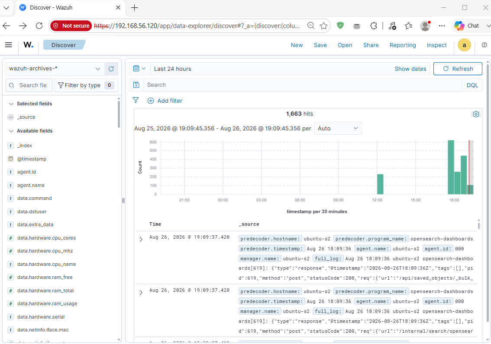

Configured the Wazuh server and archive telemetry pipeline to retain non-alerting security events, created the `wazuh-archives-*` index pattern, and verified **1,663 events** in Wazuh Discover to confirm the telemetry was successfully indexed and available for investigation.

---

## Challenges & Troubleshooting
The deployment encountered missing credentials, Filebeat configuration and certificate issues, and initially incomplete Wazuh components, with Filebeat configuration tests, service-status checks, certificate inspection, installation-file inspection, and Indexer health checks used to identify the underlying problems.

The issues were resolved by retrieving the required credentials and certificates, correcting the Filebeat and Wazuh configuration, initializing the Wazuh Indexer and Dashboard components, and restarting the affected services.

---

## Summary

**Security Decision:** Archive telemetry was enabled because retaining non-alerting events provides additional investigative evidence that would otherwise be excluded from alert-focused monitoring.

**Validation:** Successful Dashboard access, healthy Indexer status, operational Wazuh services, valid Filebeat configuration, and *1,663 indexed archive events* confirmed that the initial SIEM deployment and archive-collection pipeline were functioning correctly.

## Operational Impact
The deployment establishes a functional centralized SIEM foundation with reliable archive telemetry, improving security visibility and providing a validated platform for subsequent endpoint monitoring and detection capabilities.

---

# Part 2: Windows & Ubuntu Agents + Sysmon

## Objective 
Extend centralized security monitoring by onboarding Windows and Linux endpoints and integrating Sysmon to reduce blind spots in process and network activity.

## Scope & Assumptions 
Lab simulation with two Windows endpoints (DC1, WS01), 2 Ubuntu endpoints (DFIR‑Linux) and a Wazuh server from Part 1 for centralized monitoring.

## Skills
- SIEM administration & endpoint telemetry
- Windows/Linux administration & security monitoring
- Log analysis, troubleshooting & evidence validation
- SOC documentation

## Tools
- Wazuh Manager — for centralized telemetry collection
- Microsoft Sysmon — enhanced deep Windows endpoint telemetry
- SSH/PowerShell — deployment and system administration
- VirtualBox — controlled lab environment

## Steps

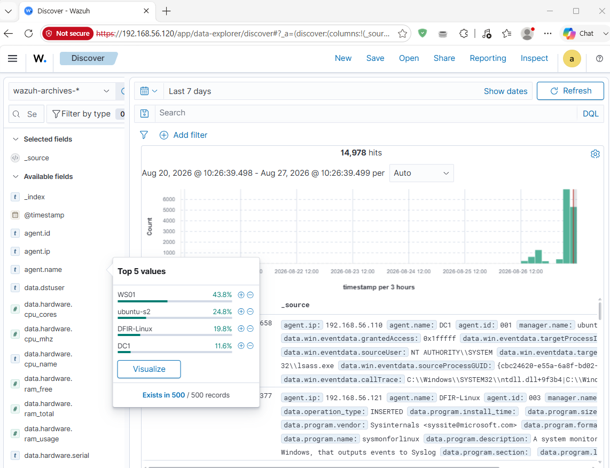

**Agent Deployment & Coverage:** Enrolled DC1, WS01 and DFIR-Linux into Wazuh and verified centralized telemetry from all monitored systems.

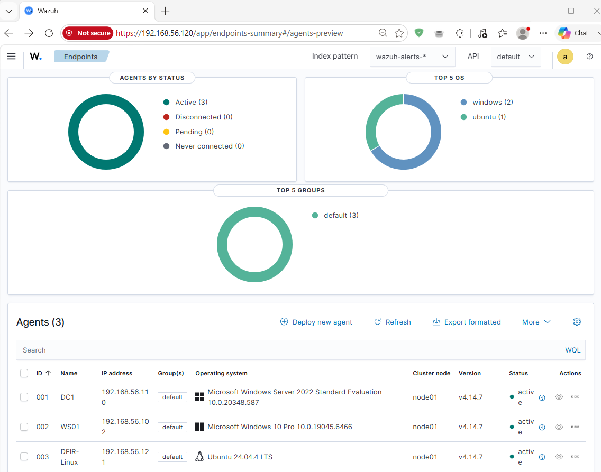

**Windows Sysmon Integration:** Configured Wazuh to collect the Sysmon Operational channel from DC1 and WS01 and verified Sysmon process and network telemetry in the archive.

**Linux Sysmon Integration:** Installed Sysmon for Linux on DFIR-Linux, applied the `collect-all.xml` configuration and verified Sysmon events were written to `/var/log/syslog` and forwarded to Wazuh.

**Telemetry Validation:** Executed `uname` on DFIR-Linux and confirmed Wazuh captured the activity as a Linux Sysmon event with `/usr/bin/uname` as the process image.

## **Challenges & Troubleshooting:** 
Windows Sysmon telemetry required explicit `ossec.conf` configuration before events appeared and restarting the Wazuh Agent resolved the issue; Linux Sysmon required installation and local log validation before telemetry was confirmed in Wazuh.

## **Summary:**

- **Investigation Findings:** Wazuh archive confirmed telemetry from all endpoints systems—DC1, WS01, DFIR-Linux, and ubuntu-s2—with Sysmon process and network events.
- **Security Decision:** Sysmon was added to strengthen endpoint visibility and support deeper investigations.
- **Validation:** Wazuh Discover confirmed active agent coverage and successful Sysmon telemetry, including the captured Linux `uname` execution.

## **Operational Impact:** 
Centralized Sysmon telemetry improved endpoint visibility, reduced monitoring blind spots, and provided the process and network evidence needed for more effective SOC investigation and incident response.

---

# Part 3 — Controlled Activity & Log Analysis

## Objective
Simulate Windows/Linux security events and analyze Wazuh telemetry to demonstrate detection and correlation of authentication, account changes, group membership modifications and SSH activity, with risk assessment applied.

## Scope & Assumptions
Conducted in a controlled lab using the existing *DeleDFIR.local Active Directory environment (DC1 and WS01)and an Ubuntu endpoint*. Wazuh served as the centralized monitoring platform for telemetry collection and analysis.

## Skills
- SIEM log analysis & correlation
- Windows/Linux telemetry interpretation (Event ID, SSH)
- SID/RID auditing & group activity trails
- Session tracking & risk assessment

## Tools
- **Wazuh:** Centralized collection, search, filtering, and analysis of Windows and Linux security telemetry.
- **Windows Event Logs:** Account creation, account deletion, logon, and group-membership activity.
- **Ubuntu/Linux:** SSH authentication and session telemetry.
- **PowerShell / Windows CLI:** Controlled account and group activity generation.
- **SSH:** Controlled Linux authentication activity.
- **Sysmon telemetry:** Session-based activity correlation.

## Steps

### Event ID 4726 — Account Deletion

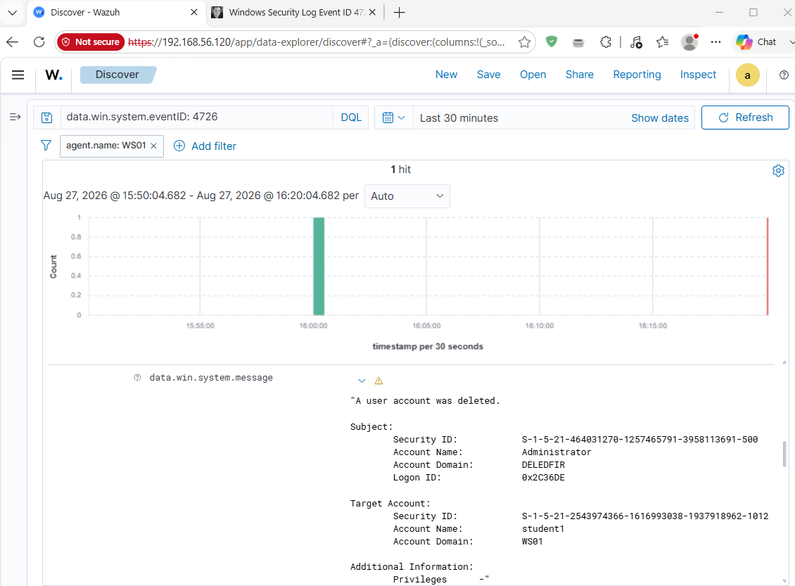

The *Subject*, identified by `RID 500`, was the Administrator account that executed the action, while the *Target Account*, identified by `RID 1012`, was the `student1` account. By parsing the *Subject SID* and correlating the `RID`, I confirmed the actor as *Administrator*. I then correlated this event with the controlled deletion of `student1` on WS01 in the *DELEDFIR domain*, validating that the activity matched the expected lab simulation.

### Event ID 4720 — Account Creation

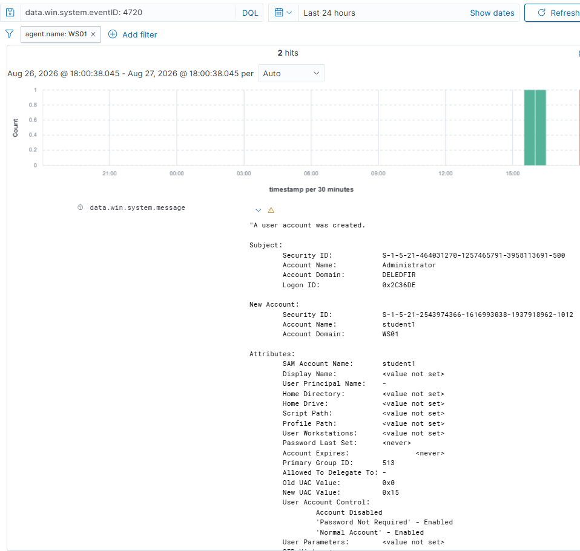

Interpreted *Event ID 4720* as a user-account creation event, identified the *Subject (RID 500)* as the account that performed the action and the *New Account (RID 1012)* as the account created, parsed the *Subject SID* and used the `RID` to identify the *Administrator account*, reviewed the account attributes including *Primary Group ID 513* as *Domain Users* and New `UAC` Value `0x15` as indicating Account Disabled, Password Not Required, and Normal Account, and correlated the event with the controlled `student1` account creation performed on WS01 in the *DELEDFIR domain*.

### Event ID 4624 — Successful Logon

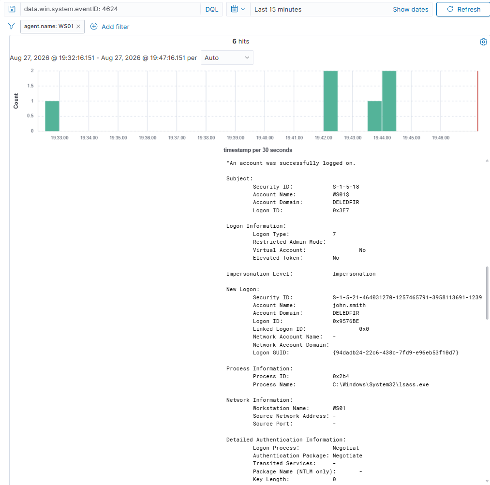

Interpreted *Event ID 4624* as a successful user logon, identified the New Logon account as *DELEDFIR\john.smith* and `RID 1239` as the relative identifier at the end of the account SID, identified *Logon Type 7* as a re-logon/unlock event, reviewed Logon ID `0x87E1C9` as a correlation point for the logon session, identified `lsass.exe` as the process handling the authentication and Negotiate as the authentication package and correlated the logon with WS01 and the *DELEDFIR domain*.

### Event ID 4732 — Local Group Membership

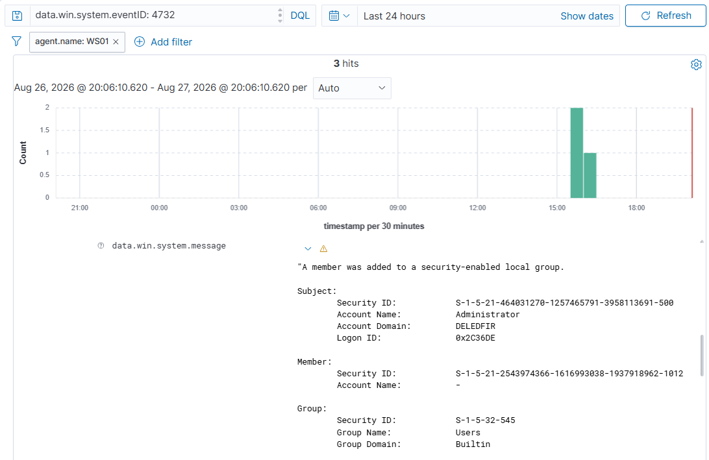

Interpreted *Event ID 4732* as a member being added to a security-enabled local group, identified the *Subject (RID 500)* as the account that performed the action and the *Member (RID 1012)* as the account added, used the *Member SID/RID* to identify the affected account as `student1` because the *Member Account Name* field was not populated, identified the target local group as Users in the Builtin domain, and correlated the event with the controlled `student1` group-membership change performed on `WS01` by *DELEDFIR\Administrator*.

### Linux SSH Authentication

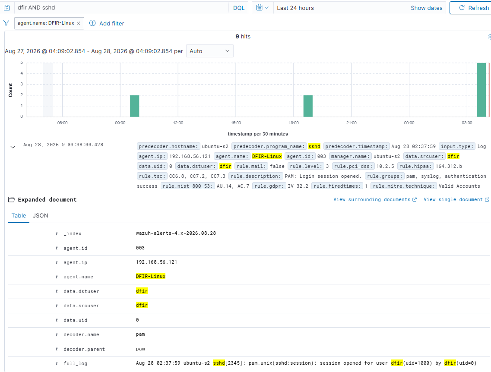

Identified a *connection reset by invalid user* for `fakeuser` from `192.168.56.1`  on port `52603`, identified a *failed password attempt* for fakeuser from the same source IP and port, searched for *dfir AND accepted* and identified a successful SSH authentication for `dfir` from 192.168.56.1 on port `52395` and interpreted the *Accepted password* event as successful authentication.

### Linux SSH Session Lifecycle

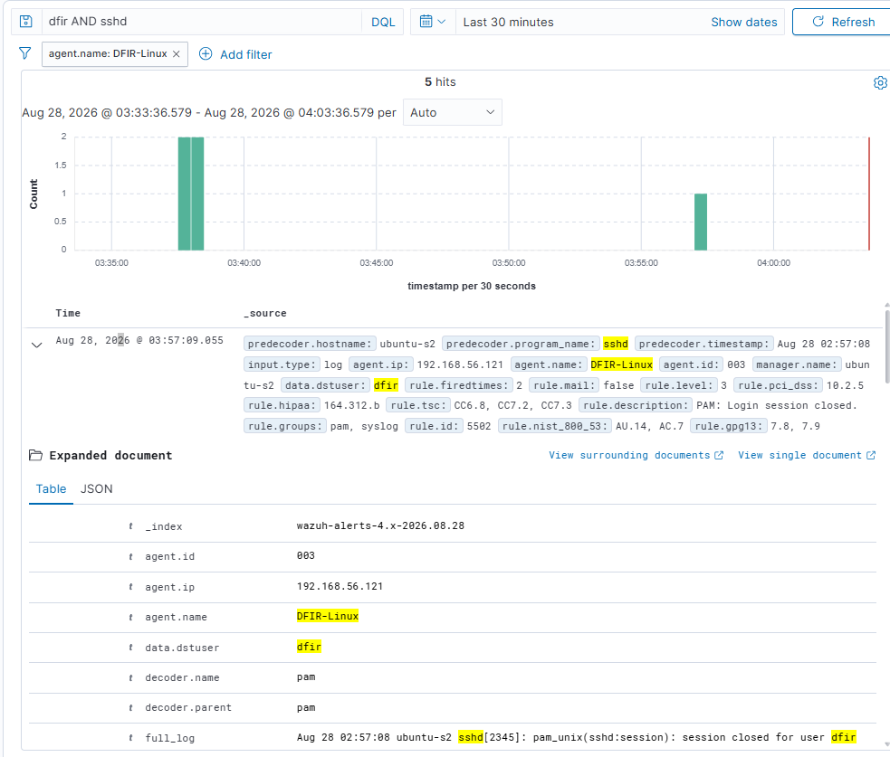

Searched for *dfir AND session* to investigate the SSH session lifecycle, confirmed the session was established through the *pam_unix(sshd:session):* session opened event, used the shared `sshd` process ID `2345` to correlate the session-open and session-close events and confirmed the SSH session started at `02:37:59` and closed at `02:57:08`.

## Challenges & Troubleshooting
Initial Windows account-management activity did not produce the expected Security events in Wazuh; investigation showed that `WS01` was not auditing User Account Management for Success and Failure, so the required audit policy was enabled with `auditpol` and the activity was repeated.

During the Linux investigation, SSH telemetry was initially searched against the Wazuh server instead of the Linux endpoint because the VM IPs were confused; correcting the target to the Linux endpoint restored the expected SSH telemetry and enabled session correlation.

## Summary

**Investigation Findings:** Evidence from Wazuh showed controlled account creation, deletion, local-group membership changes, successful Windows logon activity and a complete Linux SSH authentication/session lifecycle, including failed authentication followed by successful access and session termination.

**Investigation Rationale:** Wazuh was used as the central investigation point because correlating endpoint authentication, account-management, group-membership, session and command telemetry provides a single evidence trail for identifying potentially unauthorized activity.

**Validation:** Repeating the controlled activities after correcting the Windows audit configuration and Linux endpoint targeting confirmed that Wazuh captured the expected telemetry, including *Windows Events 4720, 4726, 4624, 4732 and Linux SSH authentication/session events*.

## Operational Impact
The investigation enabled analysts to trace Windows account creation/deletion, successful logons, local-group membership and associated privilege changes, Linux SSH authentication and session activity through centralized Wazuh telemetry.

---

# PART 4 — SOC Dashboard

## Objective
Transform existing Wazuh telemetry into a centralized SOC dashboard that provides a concise operational view of *failed Windows logons, Windows account changes overtime and Linux SSH failed authentication activity*.

## Scope & Assumptions
This is a controlled VirtualBox lab extending the existing DeleDFIR.local environment, using Wazuh archives and telemetry from the existing Windows and Linux systems.

## Skills
* SIEM dashboard development & visualization
* Windows/Linux event analysis
* Telemetry validation & SOC reporting

## Tools
- **Wazuh Dashboard** — Centralized visualization and monitoring of security telemetry.
- **Wazuh Discover** — Searching and validating archived Windows/Linux security events.
- **Wazuh archives** — Source of retained endpoint telemetry used by the dashboard panels.
- **Windows Event Logs** — Provided authentication and account-management activity for dashboard analysis.

## Steps

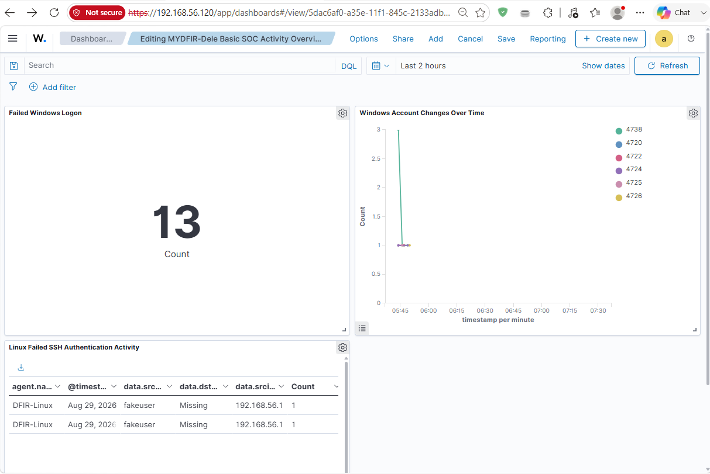

**### Failed Windows Logon:** Created a Metric visualization using `data.win.system.eventID:4625` to display the count of failed Windows logon activity.

**### Windows Account Changes Over Time:** Created a Line visualization using Windows account-management Event IDs *4720, 4722, 4723, 4724, 4725, 4726, 4732, 4733 and 4738*, with `timestamp` as the date histogram, `Count` as the metric and `data.win.system.eventID` as the split series.

**### Linux Failed SSH Authentication Activity:** Created a Data Table using the *wazuh-archives* data view, filtered to the *DFIR-Linux agent and failed password activity*, then added `agent.name`, `timestamp`, `data.source.user`, `data.dst.user` and `data.source.ip` as table buckets; enabled *Show missing values* for the destination user field.

**### Dashboard Integration:** Saved the Windows account-change visualization as *Windows Account Changes Over Time* and added the saved visualization to *MYDFIR-Dele Basic SOC Activity Overview*.

## Challenges & Troubleshooting
The *data.win.system.eventID* field was initially unavailable for Split series because the `wazuh-archives` index pattern had not refreshed its field mappings.

The field list was refreshed through Dashboard Management → Index Patterns → `wazuh-archives`, after which the Event ID field became available and the visualization displayed separate event-ID series.

## Summary
**Investigation Findings:** Wazuh Discover confirmed WS01 Windows Security telemetry including *Event IDs 4720, 4722, 4724, 4725 and 4738*, providing the evidence used to build the account-management dashboard visualization.

**Investigation Rationale:** Panel-level queries were used so each visualization could focus on its specific security activity without one dashboard-level query filtering the other panels.

**Validation:** The required Windows events were confirmed in Wazuh Discover, the Event ID field was successfully mapped and the dashboard displayed the account-management activity as separate event-ID series.

## Operational Impact
The dashboard centralized failed Windows logons, Windows account-management events over time and failed Linux SSH authentication into dedicated SOC visualizations, making these activities easier to monitor and investigate.

---

# PART 5 — File Integrity Monitoring & Custom Detection Rules

## Objective:
Implement File Integrity Monitoring (FIM) on Windows and Linux endpoints to detect monitored file creation, modification, and deletion activity, and develop and validate a custom Wazuh rule for Guest-account enablement.

## Scope & Assumptions:
Extended *DeleDFIR.local* Wazuh SOC lab to monitor both Windows and Linux endpoints. All activity was performed as a controlled security simulation to ensure that the telemetry captured could be validated against expected outcomes.

## Skills:
- SIEM monitoring
- File Integrity Monitoring (FIM)
- Detection engineering & validation
- Windows & Linux security monitoring
- Security event analysis and investigation

## Tools:
- Wazuh — centralized SIEM, FIM, event investigation, and custom detection.
- Windows WS01 — generated controlled file and account-management activity.
- Ubuntu/Linux endpoint — provided Linux FIM telemetry.
- Wazuh Dashboard/Discover — investigated archived telemetry and validated detection results.

## Steps:

[View Wazuh Custom Detection Rules](./rules/local_rules.xml)

- Configured real‑time File Integrity Monitoring (FIM) on WS01 to track changes in *C:\company data* detecting file creation, modification and deletion.

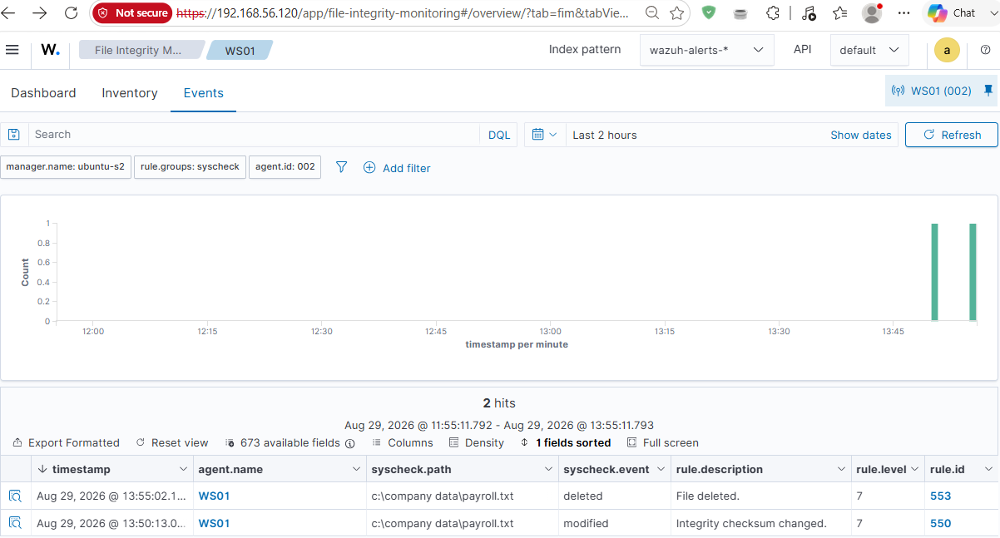

- Performed controlled modifications and deletions on the monitored Windows file and confirmed the resulting FIM events in Wazuh.

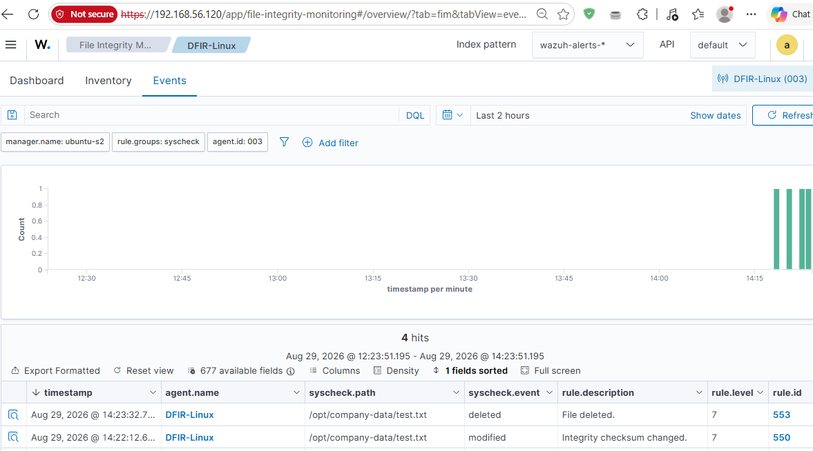

- Configured real-time FIM on the Linux endpoint for `/opt/company-data` and validated file modification and deletion events.

- Disabled the *local Guest account* on WS01 to establish the baseline for account‑enable detection. Queried Wazuh Archives for Guest account enablement using *Event ID 4722* and confirmed WS01 telemetry.

- Created custom Wazuh rule `100200` to specifically detect *Guest account enablement*, providing more focused coverage than the built‑in account‑management rule. Reloaded the rules and enabled the Guest account on WS01 to generate controlled test telemetry.

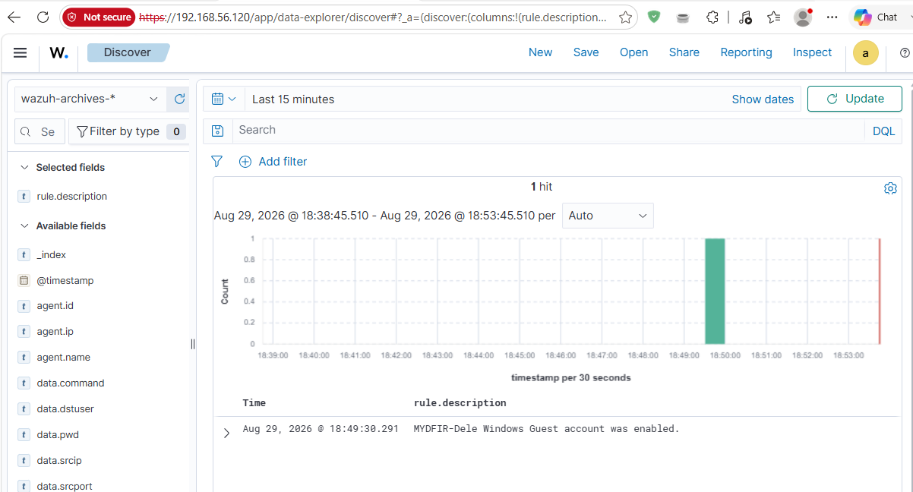

- Validated the custom detection by confirming rule `100200` generated the *MYDFIR-Dele Windows Guest account was enabled* alert.

## Challenges & Troubleshooting:
- Rule `100200` initially failed to trigger while Wazuh's built-in rule `60109` detected the same Guest-account enablement event, so the decoded event and built-in rule definition were reviewed.
- The custom rule was corrected to use the decoded *win.system.eventID* field, align with the relevant built-in rule groups and use the appropriate `if_sid` condition before reloading and retesting successfully.

## Summary
Wazuh evidence confirmed `FIM` events for monitored file changes and deletions, as well as Windows Event `ID 4722` for Guest-account enablement; comparison with rule `60109` explained why the initial custom detection did not trigger, leading to the refinement and successful validation of rule `100200` for targeted Guest-account monitoring. Controlled tests validated both Windows and Linux FIM and confirmed that the custom rule generated the alert *MYDFIR-Dele Windows Guest account was enabled*, demonstrating effective visibility and precise detection.

## Operational Impact:
Enhanced SOC visibility by combining Windows and Linux FIM with a custom Wazuh rule that specifically detects Guest-account enablement, enabling more focused monitoring and investigation of file changes and this account-management event.

---

# Part 6 — Active Response

## Objective: 
Detect repeated SSH authentication failures and automatically block the offending source to reduce the risk of brute-force access against the Linux server.

## Scope & Assumptions: 
Controlled Wazuh SOC lab using Ubuntu Wazuh server and Windows host, with Active Response configured and tested only within the isolated lab environment to ensure that blocking actions were safe, repeatable and did not affect production systems.

## Skills: 
SIEM monitoring & event analysis, detection engineering & validation, Active Response automation, Linux & firewall administration, and evidence‑based security investigation.

## Tools: 
Wazuh was used for centralized monitoring, custom detection rules, alerting and Active Response. The Ubuntu Linux server and iptables provided firewall enforcement and validation, while Windows PowerShell and SSH supported controlled attack simulation and connectivity testing.

## Steps:

[View Wazuh Custom Detection Rules](./rules/local_rules.xml)

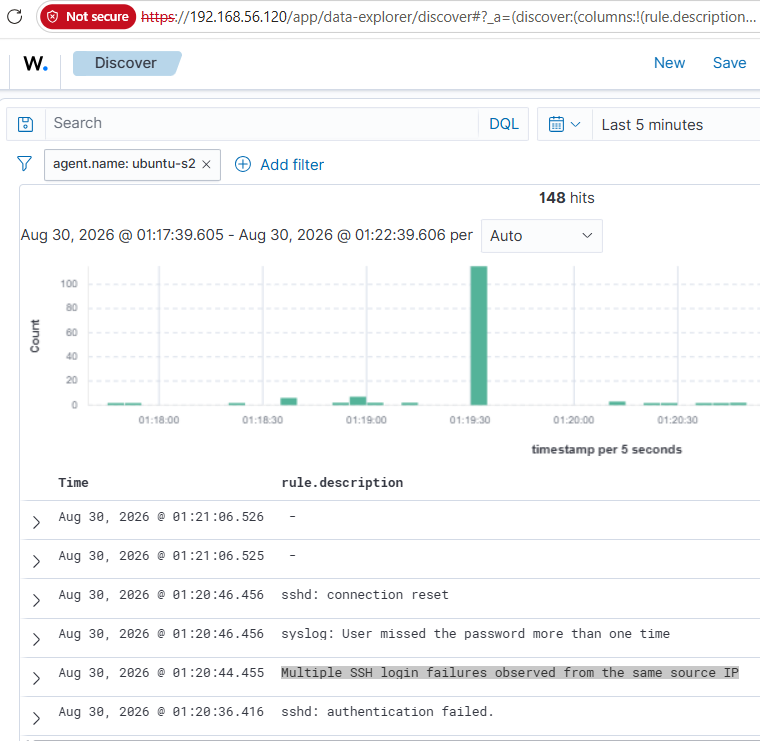

Created and validated a custom Wazuh rule that detects three failed SSH login attempts within 120 seconds, providing visibility into potential brute-force activity.

Configured Wazuh Active Response to automatically execute firewall-drop when custom rule `100101` is triggered, blocking the identified source IP.

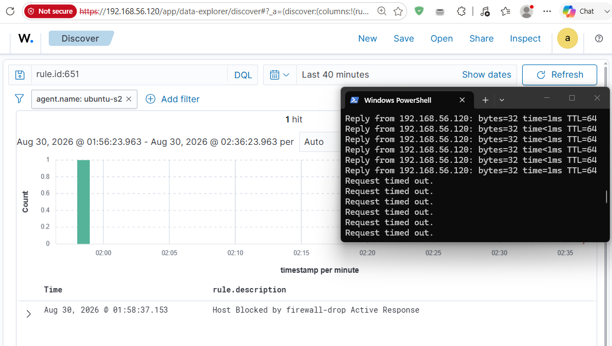

Validated automated containment by confirming the Windows host lost connectivity after the SSH brute-force threshold was reached and Wazuh generated Rule `651`, *Host Blocked by firewall-drop Active Response.*

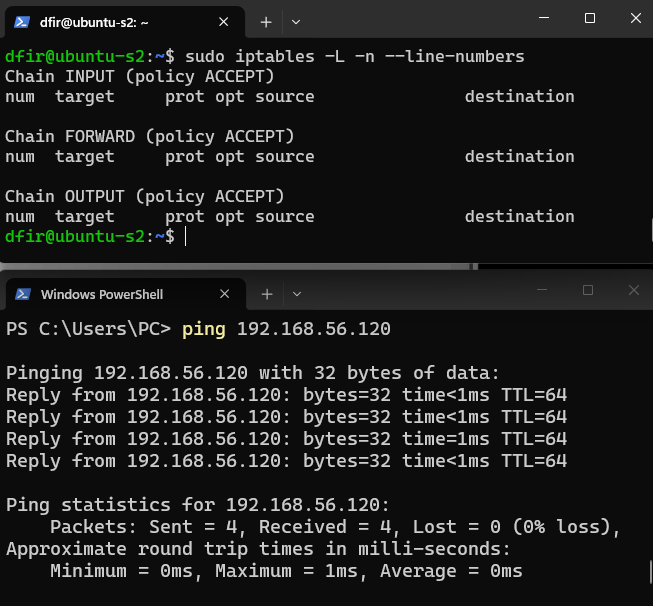

Removed the temporary `firewall-drop` rules after testing and verified that connectivity from the Windows host to the Wazuh server was restored.

## Challenges & Troubleshooting: 
The custom detection initially referenced rule `5768` instead of the actual SSH authentication-failure rule `5760`, which was identified by reviewing Wazuh event data and resolved by correcting the parent rule reference and reloading Wazuh. 

Active Response successfully blocked the Windows source, but rule `651` was not visible in Discover. To confirm execution, both *active‑responses.log and alerts.log* were reviewed, verifying that the alert had been generated as expected.

## Summary:
Wazuh evidence confirmed *three failed SSH authentication* attempts from `192.168.56.1`, which triggered custom rule `100101`. This was followed by `firewall‑drop` execution and rule `651`, verifying that the source was blocked. A `firewall‑drop` was chosen as the automated response because repeated SSH failures indicated potential brute‑force activity requiring immediate containment. Validation was completed by confirming the SSH connection timed out, verifying the DROP rule in `iptables` and reviewing *active‑responses.log and alerts.log*. `Connectivity` was then restored by removing the temporary rules, demonstrating that the Active Response worked as intended in a controlled lab environment.

## Operational Impact: 
Automated SSH brute-force detection and firewall-based containment reduced the time between repeated authentication failures and source-IP blocking, with Wazuh providing evidence of detection, response execution, and controlled connectivity restoration. This demonstrated how the SOC lab can move beyond passive monitoring into automated defense, ensuring brute‑force attempts are contained quickly while still allowing controlled recovery without leaving the lab environment blocked.